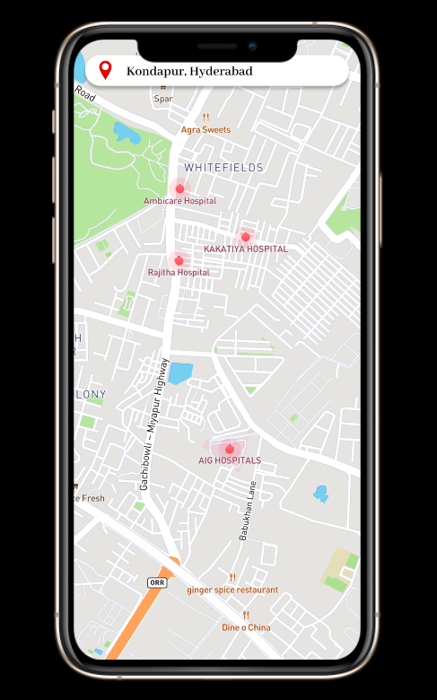
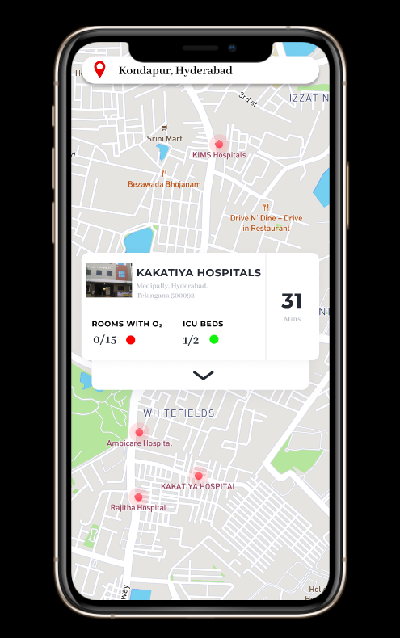
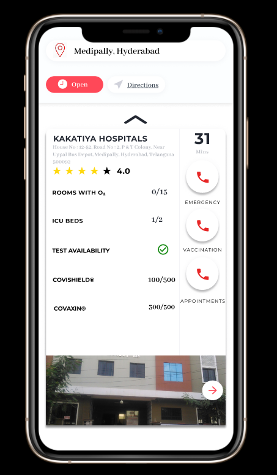

# COV-ER
##### COVid- Emergency Response, or simply COV-ER- your one-stop app with all the basic information you need in an emergency. Simply enter your location and voilà! We got you COVERed!

India currently is in a state of complete disarray. Being the worst affected country with COVID19, cases have risen astronomically over the past few weeks. With terrible local management, tens of thousands have succumbed to the pandemic in the past few days alone. The biggest issue has been the lack of proper authority in the management of hospital resources such as ICU beds and Oxygen supply due to which thousands are denied access to hospitals and have to resort to manually going to all hospitals in their locality and checking for one with resources while under duress of being affected with the virus. While there are government updated datasets on websites, these sites are rarely accessible and the simple preponderance of people who can't access and understand big data sheets have exacerbated the problem.   
 

## Features

Our application simply provides a clean and easy method of accessibility. It provides for:
- A one-stop information centre for all people wherein they can go through all the hospitals in their locale
- Gather important information on resource availability
- Get an extended view on the all resources, testing and vaccines
- Get directions to the hospital
- Have the required contact numbers to the respective departments of hospitals in order to inform their needs prior arrival. 

## Tech

COV-ER uses a number of open source projects to work properly:
, , google colab, mapgit, excode,  fcpx, bravo studio, mapsicle, google sheets, sheets sync
- Figma
- Swift
- Google Colab
- Mapgit
- Xcode
- FCPX
- Bravo Studio
- Mapsicle
- Google Sheets
- Sheets Sync
- Dillinger

## Development

All contributions are welcome. There exists a need to move forward with the application as soon as possible dude to the pandemic and all PRs with worthhile contributions will be accepted.

## License

MIT

